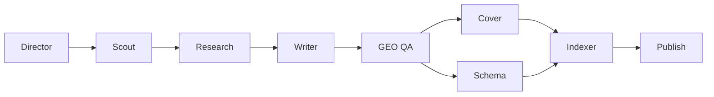

# Excalibur Blog Cloud


**Excalibur Blog Cloud** — это автоматизация блога на субагентах Cursor: не "ещё один AI-текст", а полный SEO/GEO-пайплайн статьи от подбора темы до публикации в WordPress.

Плагин собирает статью как редакция: один агент отвечает за research, другой за текст, третий за QA, отдельные агенты делают визуал, schema, перелинковку и публикацию. На выходе получается не черновик, а готовый пакет: `article.html`, мета, FAQ/schema, обложка, inline-картинки, QA-отчёты, `llms.txt` и запись в ledger.

## Что Делает

- Подбирает utility-тему через Scout и проверяет спрос.
- Собирает research: SERP, факты, источники, интент, угол статьи.
- Пишет longread в HTML по редакционному контракту.
- Прогоняет GEO/SEO QA: факты, ссылки, HTML, AI-slop, каннибализацию, human voice.
- Генерирует обложку и inline-визуалы через image pipeline + кодовые quad/split-скрипты.
- Создаёт JSON-LD: `BlogPosting`, `FAQPage`, `HowTo`, `Organization`, `Person`.
- Обновляет внутреннюю перелинковку и `llms.txt`.
- Публикует в WordPress через SSH bootstrap, без FTP.

## Архитектура



Директор работает в основном чате и запускает отдельные Task/subagents. Субагенты не запускают вложенные Task, чтобы пайплайн оставался управляемым и проверяемым.

## Субагенты

| Шаг | Subagent | Задача |
| --- | --- | --- |
| 0 | `excalibur-blog-scout` | свежая P0-тема, спрос, анти-каннибализация |
| 1 | `excalibur-blog-research` | SERP, факты, utility angle, action outline |
| 2 | `excalibur-blog-writer` | статья `article.html` + `article.meta.json` |
| 3 | `excalibur-blog-geo-qa` | QA-скрипты, fact-check, links, human voice |
| 4a | `excalibur-blog-cover` | обложка + 3 inline-визуала |
| 4b | `excalibur-blog-schema` | schema.org JSON-LD |
| 5 | `excalibur-blog-indexer` | interlink + `llms.txt` |
| 6 | `excalibur-blog-publish` | WordPress publish через SSH |
| fix | `excalibur-blog-fixer` | закрепление исправлений после инцидентов |

Cover и Schema запускаются параллельно только после `GEO QA PASS`.

## Визуальный Пайплайн

Обложки в актуальной версии не делаются "руками в MCP". Пайплайн такой:

1. `quad-manifest.json` описывает 4 панели: cover + 3 inline.
2. `excalibur_blog_cover_quad_prompt.py` собирает промпт и batch.
3. Image API создаёт единый quad-canvas 2x2.
4. `excalibur_blog_quad_apply.py` скачивает canvas.
5. `excalibur_blog_cover_quad_split.py` кодом режет canvas на `cover.png` и `inline-01..03.png`.
6. Скрипт вставляет `<figure>` в `article.html`.

Итог: один визуальный стиль, одна обложка, три полезные inline-карточки и registry с alt-текстами.

## Быстрый Старт

```bash
python -m pip install -r requirements.txt
python scripts/excalibur_blog_doctor.py
python scripts/excalibur_blog_today.py
```

Для первого запуска заполните настройки:

```bash
python scripts/excalibur_blog_setup.py
```

В Cursor можно запускать командой:

```text
/excalibur-blog-run
```

Или явно:

```text
/excalibur-blog-run topic_id: B10 publish: no
```

## Secrets

Секреты не хранятся в репозитории. Для публикации нужны только SSH-переменные:

```env
PUBLIC_SITE_URL=https://example.com
EXCALIBUR_BLOG_ALLOW_PUBLISH=yes

SSH_HOST=example.com
SSH_PORT=22
SSH_USER=
SSH_PASS=
SSH_ROOT=/
```

`FTP_*` больше не используются. Публикация идёт только через SSH.

## Основные Команды

```bash
# preflight
python scripts/excalibur_blog_doctor.py

# подготовить research-контекст по теме
python scripts/excalibur_blog_research_start.py --topic-id B01

# проверить статью перед публикацией
python scripts/excalibur_blog_link_verify.py memory/blog/articles/B01-slug/article.html

# dry-run публикации
python scripts/excalibur_blog_wp_publish.py --article-dir memory/blog/articles/B01-slug --dry-run

# publish
python scripts/excalibur_blog_wp_publish.py --article-dir memory/blog/articles/B01-slug
```

## Артефакты Статьи

```text
memory/blog/articles/<topic_id>-<slug>/
  research-context.json
  research-serp.json
  research-notes.md
  article.html
  article.meta.json
  article-qa.md
  schema.jsonld
  cover/
    cover.png
    inline-01.png
    inline-02.png
    inline-03.png
    cover-registry.json
  wp-publish-result.json
```

## Безопасность

- Не коммитьте `memory/site.env.local`.
- Не пишите SSH/API-ключи в handoff, README, PR или logs.
- Runtime-файлы `.cursor/excalibur-blog-handoff.md` и fragments игнорируются.
- Publish без `EXCALIBUR_BLOG_ALLOW_PUBLISH=yes` должен завершаться явным blocker.

## Для Кого

Для команд, которым нужен блог не как "генератор текстов", а как повторяемая система: SEO/GEO, AI-search, WordPress, визуалы, QA и публикация по расписанию.

**Excalibur Blog Cloud: твой блог — твоё королевство, контент — твоя сила.**
